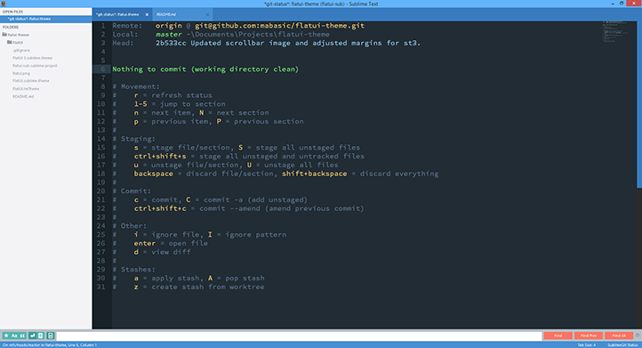

# FlatUI Theme

Flat UI theme for Sublime Text 2 and Sublime Text 3.

Project site: Coming soon.

## Design

## Installation

FlatUI theme is designed to work with the latest development builds of Sublime Text, including [Sublime Text 2](http://www.sublimetext.com/dev) and [Sublime Text 3](http://www.sublimetext.com/3dev).

### Using Git

If you are a git user, you can install the theme and keep up to date by cloning the repo directly into your `Packages` directory in the Sublime Text application settings area.

You can locate your Sublime Text `Packages` directory by using the menu item `Preferences -> Browse Packages...`.

While inside the `Packages` directory, clone the theme repository using the command below:

    git clone https://github.com/acondiff/flatui-theme/ "Theme - FlatUI"

### Download Manually

* Download the files using the GitHub .zip download option
* Unzip the files and rename the folder to `Theme - FlatUI`
* Find your `Packages` directory using the menu item  `Preferences -> Browse Packages...`
* Copy the folder into your Sublime Text `Packages` directory

## Activating the theme

To configure Sublime Text to use the theme, follow the instructions below for your specific version.

### Sublime Text 2

* Open your User Settings Preferences file `Sublime Text 2 -> Preferences -> Settings - User`
* Add (or update) your theme entry to be `"theme": "FlatUI.sublime-theme"`
* RESTART Sublime Text 2

**Example Sublime Text 2 User Settings**

    {
        "theme": "FlatUI.sublime-theme"
    }

### Sublime Text 3

* Open your User Settings Preferences file `Sublime Text -> Preferences -> Settings - User`
* Add (or update) your theme entry to be `"theme": "FlatUI 3.sublime-theme"`
* RESTART Sublime Text 3

**Example Sublime Text 3 User Settings**

    {
        "theme": "FlatUI 3.sublime-theme"
    }

## Additional Features

### Sidebar Folder Icons

FlatUI Theme has the ability to use folder icons in the sidebar.

If you'd like to use folder icons in the sidebar instead of the regular arrows, add the following custom setting to your `Settings - User` file:

    "flatui_folder_icons": true

### Retina Resolution UI

FlatUI Theme has been designed to take advantage of retina resolution (high-dpi) displays.

### Theme Customisation

Sublime Text provides an elegant way to tweak existing themes without having to duplicate or maintain a separate copy of the original theme. If there are aspects of FlatUI Theme that you would like to adjust, take a look at the [theme customisation](https://github.com/buymeasoda/soda-theme/wiki/Theme-customisation) wiki page.

## Bonus Options

### Syntax Highlighting Color Schemes

The FlatUI theme uses a custom syntax highlighting color scheme.

If you'd like to use the syntax highlighting schemes: 

* Locate the `tmtheme` file in `Packages/Theme - FlatUI/Color Schemes/`
* Copy and paste the `tmtheme` file in the Sublime Text `Packages/User` folder
* Enable the colour scheme via `Preferences -> Color Scheme -> User`

### Use thinner tabs
In your User Settings file, add the following line `"flatui_thin_tabs": true,`

### Use sidebar folder icons 

In your User Settings file, add the following line `"flatui_folder_icons": true,`

## Font

Reccomended font: Adobe Source Code Pro (https://github.com/adobe/source-code-pro)

## License

Based on Soda Theme by Ian Hill (http://buymeasoda.com/)

Based on FlatUI Theme by acondiff (https://github.com/acondiff/flatui-theme)

